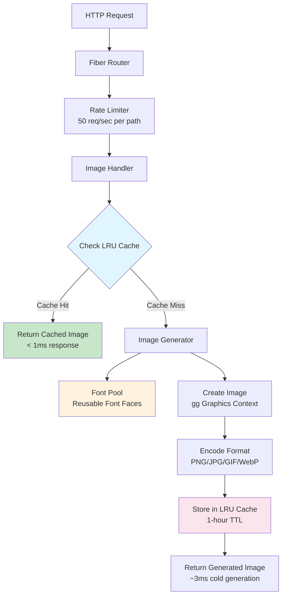

# Placeholder Image Generator

A high-performance placeholder image generator built with Go and Fiber framework. Generate custom placeholder images on-the-fly with configurable dimensions, colors, and text.

## Features

- ⚡ **Ultra Fast**: LRU memory caching with sub-millisecond response times
- 🎨 **Multiple Formats**: Support for PNG, JPG, GIF, WebP
- 🎯 **Customizable**: Custom text, colors, and dimensions
- 📦 **Memory Efficient**: Smart font pooling and resource management
- 🌐 **CORS Enabled**: Full cross-origin support for web applications
- 🔒 **Rate Limited**: Built-in protection against abuse
- 📊 **Production Ready**: Comprehensive logging and error handling

## Quick Start

### Installation

```bash
git clone github.com/gopkg-dev/placeholder
cd placeholder
go mod tidy
go run .
```

### Usage

Generate placeholder images using simple HTTP GET requests:

```bash
# Basic 300x200 PNG
http://localhost:8888/api/placeholder/300x200

# Custom colors and format
http://localhost:8888/api/placeholder/400x300.jpg?bg=ff0000&fg=ffffff

# Custom text
http://localhost:8888/api/placeholder/500x300?text=Hello%20World

# Multiple parameters
http://localhost:8888/api/placeholder/600x400.webp?bg=1e1e1e&fg=00ff00&text=Custom%20Image
```

## API Reference

### Endpoint

```bash
GET /api/placeholder/{size}[.{format}][?parameters]
```

### Parameters

| Parameter | Type | Description | Default |
|-----------|------|-------------|---------|
| `size` | string | Image dimensions in WxH format (e.g., "300x200") | Required |
| `format` | string | Image format: png, jpg, jpeg, gif, webp | png |
| `bg` | string | Background color (6-digit hex without #) | cccccc |
| `fg` | string | Text color (6-digit hex without #) | 666666 |
| `text` | string | Custom text to display | {width}x{height} |

### Examples

#### Basic Examples

- `GET /api/placeholder/300x200` - Simple 300x200 PNG
- `GET /api/placeholder/400x300.jpg` - JPEG format
- `GET /api/placeholder/500x400.gif` - GIF format

#### Custom Colors

- `GET /api/placeholder/300x200?bg=ff0000` - Red background
- `GET /api/placeholder/300x200?fg=ffffff` - White text
- `GET /api/placeholder/300x200?bg=000000&fg=ffffff` - Black background, white text

#### Custom Text

- `GET /api/placeholder/300x200?text=Logo` - Display "Logo"
- `GET /api/placeholder/400x300?text=Hello%20World` - URL-encoded text
- `GET /api/placeholder/500x300?text=Custom&bg=blue&fg=white` - Combined parameters

## Performance

- **Cold Start**: ~3ms image generation
- **Cache Hit**: <1ms response time
- **Memory Usage**: Efficient LRU cache with automatic cleanup
- **Concurrency**: 50 requests/second rate limiting per path

## Architecture



## Configuration

Default settings can be modified in the source code:

```go
const (
    MaxImageSize = 3000      // Maximum image dimension
    DefaultBg    = "cccccc"  // Default background color
    DefaultFg    = "666666"  // Default text color
    DefaultType  = "png"     // Default image format
)
```

## Development

### Requirements

- Go 1.21+
- Dependencies managed with Go modules

### Building

```bash
go build -o placeholder
./placeholder
```

### Testing

```bash
# Test basic functionality
curl http://localhost:8888/api/placeholder/300x200

# Test with parameters
curl "http://localhost:8888/api/placeholder/400x300.jpg?bg=ff0000&fg=ffffff&text=Test"

# Test Chinese text support
curl "http://localhost:8888/api/placeholder/500x300?text=占位图&bg=1e1e1e&fg=ffffff"
curl "http://localhost:8888/api/placeholder/400x200.png?text=测试中文&bg=0066cc&fg=ffffff"
curl "http://localhost:8888/api/placeholder/350x250.webp?text=示例图片&bg=e91e63&fg=ffffff"

# Test Japanese and Korean text
curl "http://localhost:8888/api/placeholder/400x300?text=プレースホルダー&bg=2196f3&fg=ffffff"
curl "http://localhost:8888/api/placeholder/350x200?text=플레이스홀더&bg=ff5722&fg=ffffff"

# Test mixed text with emojis
curl "http://localhost:8888/api/placeholder/500x300?text=🌟中文测试🎯&bg=4caf50&fg=ffffff"
```

## License

MIT License - see LICENSE file for details.

## Contributing

1. Fork the repository
2. Create your feature branch (`git checkout -b feature/amazing-feature`)
3. Commit your changes (`git commit -m 'Add some amazing feature'`)
4. Push to the branch (`git push origin feature/amazing-feature`)
5. Open a Pull Request

## Support

For issues and feature requests, please open an issue on GitHub.
